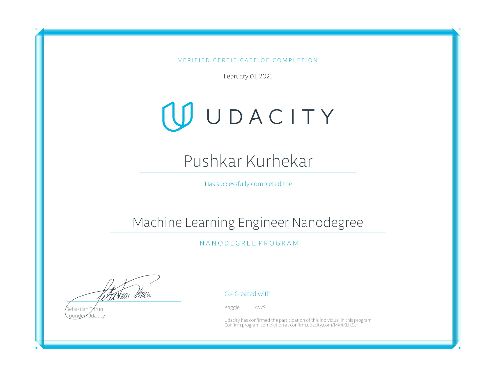

# Denoising Images using Autoencoders
This project was my Capstone Project for the Udacity Machine Learning Engineer Nanodegree.

# Required Libraries
- numpy
- tensorflow
- scikit-learn
- matplotlib
- pandas

# Dataset Links
[Kaggle Competition](https://www.kaggle.com/c/denoising-dirty-documents)

[UCI Machine Learning Repository](https://archive.ics.uci.edu/ml/datasets/NoisyOffice)

# Execution
The code has been tested on Google Colab, with a GPU runtime.
All the libraries above are already pre-installed in Google Colab.
To execute locally, you will need to change the paths where the dataset is stored.
The dataset zip will need to be kept inside the data folder.
